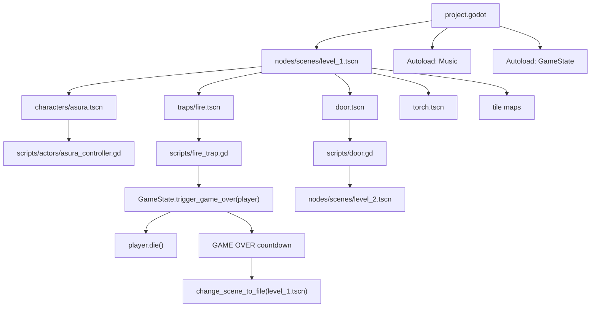

# Dungeon Traps - Kiến Trúc Dự Án

Cập nhật: 2026-07-07

## Mục Tiêu Kiến Trúc

Kiến trúc nên giúp project dễ mở rộng level, thêm trap/enemy/item mới, và giữ logic gameplay tách khỏi layout từng map. Dự án hiện đã có nền tảng tốt: level scene chứa placement, reusable scene cho trap/door/torch/player, và `GameState` làm autoload cho death flow. Các việc đã được chuẩn hóa gần đây: controller Asura được đổi tên, score manager được dời khỏi assets, `killzone.gd` dùng chung `GameState`, player knight cũ đã được xóa, và Asura dùng collision layer player.

## Sơ Đồ Runtime Hiện Tại



## Lớp Trách Nhiệm

### 1. Project Config

`project.godot` định nghĩa main scene, input map, autoload và render defaults.

Trách nhiệm:

- Không chứa logic gameplay.
- Chỉ khai báo cấu hình global.
- Autoload nào nằm ở đây phải thật sự global.

Hiện tại:

- `Music`: nhạc nền autoplay.
- `GameState`: trạng thái game và restart flow.

### 2. Level Scenes

Level scene chịu trách nhiệm layout và placement.

Hiện tại:

- `nodes/scenes/level_1.tscn`
- `nodes/scenes/level_2.tscn`

Nên chứa:

- Player instance.
- Camera/ánh sáng gắn với player nếu level cần.
- TileMap/background.
- Instances của trap, door, torch, enemy, item.
- Cấu hình instance-specific như `Door.next_scene_path`.

Không nên chứa:

- Logic death/restart riêng.
- Logic player movement.
- Logic global score/state.

### 3. Reusable Gameplay Scenes

Các scene nhỏ có thể reuse qua nhiều level.

| Scene | Chủ sở hữu logic |
| --- | --- |
| `characters/asura.tscn` | `scripts/actors/asura_controller.gd` |
| `traps/fire.tscn` | `scripts/fire_trap.gd` |
| `door.tscn` | `scripts/door.gd` |
| `torch.tscn` | Animation/PointLight2D trong scene |
| `effects/landing_dust.tscn` | `scripts/landing_dust.gd` |

Rule đề xuất:

- Một scene reusable chỉ biết về behavior của chính nó.
- Nếu cần đổi state global, gọi autoload hoặc emit signal.
- Nếu cần cấu hình per-level, dùng `@export`.

### 4. Scripts

Script nên nằm ở `res://scripts/` và chia nhóm theo domain khi project lớn hơn.

Hiện tại project đã có nhóm `scripts/actors/` và `scripts/ui/`; một số script gameplay nhỏ vẫn đang flat trong `scripts/`.

Điểm còn cần quyết định:

- Có giữ `nodes/game.tscn` như scene tutorial/legacy không, hay archive/xóa khi không cần.
- Có move tiếp các script flat vào nhóm `gameplay/`, `hazards/`, `items/`, `effects/` không.
- Có đổi folder `nodes/scenes/` thành `nodes/levels/` hoặc `scenes/levels/` không.

### 5. Assets

Asset là dữ liệu thụ động: texture, sound, music, font.

Rule đề xuất:

- `assets/` không chứa script gameplay.
- Sprite nhân vật có thể chia theo character.
- Audio nên chia `music/` và `sounds/` như hiện tại.
- Font dùng chung nên nằm trong `assets/fonts/`.

## Luồng Chính

### Player Movement

`asura.tscn` là `CharacterBody2D`, thuộc group `player`, dùng `scripts/actors/asura_controller.gd`.

`asura_controller.gd` xử lý:

- Gravity.
- Jump.
- Move trái/phải.
- Flip sprite.
- Attack bằng phím `attack`.
- Animation idle/run/jump/attack/death.
- Landing dust khi rơi đủ nhanh.
- Disable collision khi chết.

Điểm cần chú ý:

- Trong lúc attack, velocity x bị set về 0.
- Khi chết, script không dùng `move_and_slide()` mà cộng gravity rồi cộng trực tiếp vào `position`, tạo hiệu ứng văng lên/rơi xuống.
- Method `die()` là contract mà `GameState` đang dựa vào.

### Game Over

`fire_trap.gd` và `killzone.gd` đều đi qua cùng một death flow:

```text
Hazard body_entered
  -> nếu body thuộc group player
  -> /root/GameState.trigger_game_over(body)
  -> player.die()
  -> overlay countdown
  -> reload level_1
```

Quyết định kiến trúc hiện tại: mọi hazard gây chết nên gọi `GameState.trigger_game_over(body)`, không tự reload scene.

### Door / Level Transition

`door.gd` dùng hai Area2D:

- `OpenArea`: player vào thì play animation mở cửa.
- `PassArea`: player vào khi cửa đã mở thì đổi scene.

`next_scene_path` là `@export`, cấu hình trong từng level instance.

Điểm cần chú ý:

- Nếu `next_scene_path` rỗng, door không đổi scene.
- `level_1` đã trỏ sang `level_2`.
- `level_2` hiện chưa cấu hình level sau.

### Music

`Music` là autoload scene `nodes/music.tscn`, node root là `AudioStreamPlayer2D`, autoplay file `time_for_adventure.mp3`.

Nếu cần nhiều track sau này, nên đổi từ scene audio đơn giản sang script `MusicManager` có API:

- `play_track(path)`
- `fade_to(path)`
- `set_music_volume(value)`

## Collision Và Groups

Hiện tại:

- `asura.tscn`: group `player`, `collision_layer = 2`, `collision_mask = 1`.
- `fire.tscn`: `collision_mask = 3`, bắt layer 1 và 2.
- `door.tscn`: `collision_mask = 3`, bắt layer 1 và 2.
- `coin.tscn`: `collision_mask = 2`, bắt player.
- `killzone.tscn`: `collision_mask = 2`, bắt player.
- Player knight cũ đã được xóa khỏi project.

Đề xuất chuẩn hóa:

| Layer | Ý nghĩa |
| --- | --- |
| 1 | World / TileMap / Platform |
| 2 | Player |
| 3 | Enemy |
| 4 | Hazard |
| 5 | Item / Pickup |

Rule:

- Mọi player scene phải ở layer 2 và group `player`.
- Hazard dùng group check để xác nhận player, mask có thể chỉ bắt layer 2.
- Item chỉ bắt layer 2.
- Enemy/hazard không nên phụ thuộc vào việc player nằm layer 1.

## Kiến Trúc Thư Mục Đề Xuất

Dự án hiện dùng `nodes/` cho scene và `scripts/` cho script. Có thể giữ convention này, hoặc đổi sang `scenes/`. Điều quan trọng là chọn một kiểu và nhất quán.

Đề xuất nếu refactor mạnh:

```text
res://
  assets/
    audio/
      music/
      sfx/
    fonts/
    sprites/
      characters/
        asura/
      enemies/
      environment/
      items/
      traps/
      ui/
  scenes/
    autoload/
      music.tscn
    characters/
      asura.tscn
    enemies/
      slime.tscn
    effects/
      landing_dust.tscn
    gameplay/
      door.tscn
      platform.tscn
    items/
      coin.tscn
    levels/
      level_1.tscn
      level_2.tscn
    traps/
      fire.tscn
    ui/
      hud.tscn
  scripts/
    autoload/
      game_state.gd
      music_manager.gd
    actors/
      asura_controller.gd
      slime.gd
    effects/
      landing_dust.gd
    gameplay/
      door.gd
      platform.gd
    hazards/
      fire_trap.gd
      killzone.gd
    items/
      coin.gd
    ui/
      game_manager.gd
  docs/
```

Đề xuất nếu muốn refactor ít rủi ro hơn, giữ `nodes/`:

```text
res://
  nodes/
    autoload/
    characters/
    enemies/
    effects/
    gameplay/
    items/
    levels/
    traps/
    ui/
  scripts/
    autoload/
    actors/
    effects/
    gameplay/
    hazards/
    items/
    ui/
```

## Mapping Refactor Đề Xuất

| Hạng mục | Trạng thái | Lý do |
| --- | --- | --- |
| Controller Asura | Đã đặt tại `scripts/actors/asura_controller.gd` | Script điều khiển Asura có tên đúng domain |
| Score manager legacy | Đã đặt tại `scripts/ui/game_manager.gd` | Script không còn nằm trong asset sprite |
| `nodes/scenes/level_1.tscn` | `scenes/levels/level_1.tscn` hoặc `nodes/levels/level_1.tscn` | Tên folder rõ nghĩa hơn |
| `nodes/scenes/level_2.tscn` root `Level1` | root `Level2` | Đã làm: tránh nhầm khi debug scene tree |
| `nodes/game.tscn` | `scenes/legacy/tutorial_game.tscn` hoặc xóa sau khi không dùng | Tách scene legacy khỏi luồng chính |
| `killzone.gd` death flow cũ | gọi `GameState.trigger_game_over()` | Đã làm: một luồng chết duy nhất |
| player layer không thống nhất | mọi player dùng layer 2 | Đã làm với Asura; player knight cũ đã xóa |

## Thứ Tự Refactor An Toàn

1. Tạo folder mới nhưng chưa move file. Đã làm cho `scripts/actors/` và `scripts/ui/`.
2. Chuẩn hóa naming trước: root `Level2` và controller Asura. Đã làm.
3. Move script logic ra khỏi `assets/`. Đã làm với `game_manager.gd`.
4. Update scene references và chạy Godot headless sau mỗi nhóm move. Đã làm trong lượt refactor này.
5. Thống nhất death flow: `killzone.gd` gọi `GameState`. Đã làm.
6. Chuẩn hóa collision layers/masks. Đã làm với Asura; còn có thể siết `fire.tscn` và `door.tscn` từ mask 3 xuống mask 2 sau khi test đầy đủ.
7. Quyết định `nodes/game.tscn` là tutorial được giữ, hay legacy được archive/xóa.

## Checklist Khi Thêm Level Mới

- Tạo scene level mới dưới folder levels.
- Root node đặt đúng tên level, ví dụ `Level3`.
- Instance player scene thống nhất.
- Camera gắn dưới player hoặc được quản lý rõ ràng.
- TileMap có collision layer world.
- Door cuối level có `next_scene_path`.
- Trap dùng reusable trap scenes, không copy logic vào level.
- Test death flow từ mọi hazard.
- Test chuyển scene và restart sau game over.

## Checklist Khi Thêm Trap Mới

- Trap là `Area2D` hoặc node phù hợp.
- Trap kiểm tra `body.is_in_group("player")`.
- Trap gọi `GameState.trigger_game_over(body)` nếu gây chết.
- Collision mask chỉ bắt layer player sau khi layer đã chuẩn hóa.
- Animation/lighting nằm trong scene trap.
- Script trap không tự reload scene.

## Checklist Khi Thêm Nhân Vật

- Character root là `CharacterBody2D`.
- Thuộc group `player` nếu là player-controlled.
- Có method `die()` để tương thích `GameState`.
- Collision layer/mask theo convention.
- Animation names được script gọi phải tồn tại trong SpriteFrames.
- Nếu cần controller mới, đặt script theo tên nhân vật hoặc vai trò rõ ràng.

## Ranh Giới Nên Giữ

- Level chỉ place object và cấu hình instance.
- Player chỉ quản lý input, movement, animation và trạng thái chết của chính nó.
- Trap chỉ phát hiện va chạm và báo game state.
- Door chỉ quản lý mở cửa và chuyển scene.
- GameState chỉ quản lý state global, overlay game over và restart.
- Asset folder chỉ chứa dữ liệu visual/audio/font.

## Việc Nên Làm Tiếp

- Tạo HUD scene riêng nếu score/health/timer quay lại trong luồng chính.
- Quyết định giữ, archive hoặc xóa `nodes/game.tscn` vì main scene hiện là `nodes/scenes/level_1.tscn`.
- Cân nhắc move `nodes/scenes/` sang `nodes/levels/` hoặc `scenes/levels/` bằng Godot editor để folder level rõ nghĩa hơn.
- Siết collision mask của `fire.tscn` và `door.tscn` về layer player sau khi test các overlap cần thiết.
- Theo dõi warning cleanup `ObjectDB instances leaked/resource still in use` khi chạy headless nếu nó bắt đầu ảnh hưởng test tự động.
- Re-export Web để `export_html/` phản ánh thay đổi gameplay mới.
