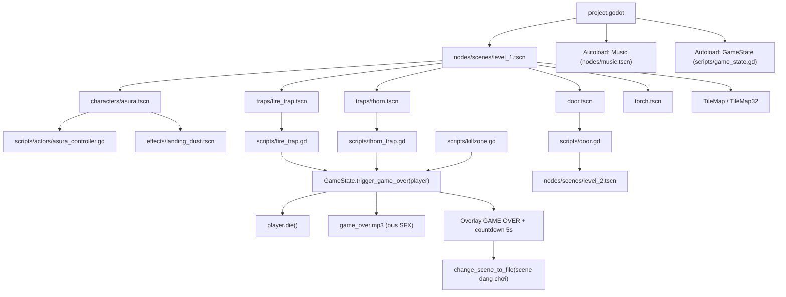

# Dungeon Traps - Kiến Trúc Dự Án

Cập nhật: 2026-08-10

## Mục Tiêu Kiến Trúc

Kiến trúc phải giúp project dễ mở rộng level, dễ thêm trap/enemy/item mới, và giữ logic gameplay tách khỏi layout của từng map.

Nền tảng hiện tại đã ổn định:

- Level scene chỉ chứa placement, không chứa logic.
- Trap/door/torch/player là reusable scene độc lập.
- `GameState` là autoload duy nhất sở hữu death flow và restart.
- Mọi hazard đi qua cùng một entry point `GameState.trigger_game_over(body)`.
- Audio đã tách bus `Music` và `SFX`.

## Sơ Đồ Runtime Hiện Tại



## Lớp Trách Nhiệm

### 1. Project Config

`project.godot` định nghĩa main scene, input map, autoload, global group và render defaults. Không chứa logic gameplay.

Hiện tại:

- Main scene: `nodes/scenes/level_1.tscn` (trỏ bằng UID `uid://l1dhtqji1d6x`).
- Autoload `Music`: scene `nodes/music.tscn`, `AudioStreamPlayer2D` autoplay `background_music.mp3` trên bus `Music`.
- Autoload `GameState`: `scripts/game_state.gd`.
- Global group: `player`.
- Input actions: `move_left` (A/←), `move_right` (D/→), `jump` (Space), `attack` (C).

`default_bus_layout.tres` định nghĩa bus `Music` (-6 dB) và `SFX` (0 dB), cả hai gửi về `Master`.

### 2. Level Scenes

Level scene chỉ chịu trách nhiệm layout và placement.

Hiện tại: `nodes/scenes/level_1.tscn` (root `Level1`), `nodes/scenes/level_2.tscn` (root `Level2`).

Nên chứa:

- Player instance, camera và `PointLight2D` gắn dưới player.
- TileMap/background.
- Instance của trap, door, torch, enemy, item — gom theo node nhóm (`FireList`, `ThornList`, `TorchList`).
- Cấu hình instance-specific như `Door.next_scene_path`.

Không nên chứa:

- Logic death/restart riêng.
- Logic player movement.
- Logic global state.

Ghi chú: cả hai level đều **không gắn script** vào root node. Logic level (nếu cần sau này) nên đi qua autoload hoặc script riêng, không nhét vào scene.

### 3. Reusable Gameplay Scenes

| Scene | Chủ sở hữu logic |
| --- | --- |
| `characters/asura.tscn` | `scripts/actors/asura_controller.gd` |
| `traps/fire_trap.tscn` | `scripts/fire_trap.gd` |
| `traps/thorn.tscn` | `scripts/thorn_trap.gd` |
| `door.tscn` | `scripts/door.gd` |
| `killzone.tscn` | `scripts/killzone.gd` |
| `torch.tscn` | Animation + `PointLight2D` trong scene, không script |
| `effects/landing_dust.tscn` | `scripts/landing_dust.gd` |
| `enemies/slime.tscn` | `scripts/slime.gd` (chỉ dùng trong `game.tscn` legacy) |
| `items/coin.tscn` | `scripts/coin.gd` (chỉ dùng trong `game.tscn` legacy) |
| `platform.tscn`, `tile_map_32.tscn` | Không script |

Rule:

- Một scene reusable chỉ biết về behavior của chính nó.
- Muốn đổi state global thì gọi autoload hoặc emit signal.
- Cần cấu hình per-level thì dùng `@export`.

### 4. Scripts

Script nằm ở `res://scripts/`, có nhóm `actors/` và `ui/`; các script gameplay nhỏ hiện vẫn flat trong `scripts/`.

Script đang orphan, cần dọn:

- `scripts/level_1_controller.gd` và `scripts/level_2_controller.gd`: chỉ có `extends Node2D`, không scene nào gắn.
- `nodes/traps/gai.tscn`: scene gai bản cũ, vẫn gắn `fire_trap.gd`, đã bị `traps/thorn.tscn` thay thế và không level nào instance.

### 5. Assets

Asset là dữ liệu thụ động: texture, sound, music, font. `assets/` không chứa script gameplay.

Sound đang thật sự được scene sử dụng: `running.mp3`, `sword_attack.mp3` (Asura), `fireball_whoosh.mp3` (fire trap), `coin.wav` (coin legacy), `game_over.mp3` (`GameState` preload). Các file còn lại trong `assets/sounds/` hiện chưa được tham chiếu.

## Luồng Chính

### Player Movement

`asura.tscn` là `CharacterBody2D`, group `player`, layer 2, mask 1, script `scripts/actors/asura_controller.gd`.

Script xử lý gravity, jump, move trái/phải, flip sprite, attack (xen kẽ `attack`/`attack2`, trên không luôn `attack2`), animation idle/run/jump_up/jump_down/death, landing dust khi tốc độ rơi vượt `LANDING_DUST_MIN_SPEED`, và `die()`.

Điểm cần chú ý:

- Trong lúc attack, `velocity.x` bị set về 0.
- Khi chết, script không dùng `move_and_slide()` mà cộng gravity rồi cộng thẳng vào `position`, tạo hiệu ứng văng lên rồi rơi.
- `die()` tắt collision layer/mask và disable `CollisionShape2D`.
- `die()` là contract mà `GameState` dựa vào; nhân vật mới bắt buộc phải có method này.

### Game Over

`fire_trap.gd`, `thorn_trap.gd` và `killzone.gd` dùng chung một death flow:

```text
Hazard body_entered
  -> nếu body thuộc group player
  -> /root/GameState.trigger_game_over(body)
  -> state = GAME_OVER, lưu scene hiện tại
  -> phát game_over.mp3 (bus SFX)
  -> player.die()
  -> overlay CanvasLayer layer 100 + countdown 5 giây
  -> change_scene_to_file(scene đang chơi)
  -> reset_to_playing()
```

Quyết định kiến trúc: mọi hazard gây chết phải gọi `GameState.trigger_game_over(body)`, không tự reload scene.

`GameState` chạy `PROCESS_MODE_ALWAYS`, và restart về **scene đang chơi** (`_get_current_scene_path()`) chứ không cố định level 1; `DEFAULT_RESTART_SCENE_PATH` chỉ là fallback.

### Fire Trap

Bẫy lửa có hai vùng: `TriggerArea` (mask 2) và vùng damage của chính `Area2D` root (mask 2).

```text
_ready: sprite ẩn, damage shape tắt
TriggerArea.body_entered (player)
  -> tắt monitoring của trigger
  -> hiện sprite, phát AppearSound
  -> bật damage shape và monitoring
body_entered (player) -> GameState.trigger_game_over()
```

### Thorn Trap

`traps/thorn.tscn` là `Node2D` chứa `Hazard` (Area2D) và `TriggerArea`.

```text
_ready: physics process tắt
TriggerArea.body_entered (player) -> _is_falling = true, bật physics process
_physics_process: raycast xuống 3 điểm (-half_width, 0, +half_width)
  -> chạm sàn thì snap vào mặt sàn và dừng
  -> hoặc rơi quá max_fall_distance thì dừng
Hazard.body_entered (player) -> GameState.trigger_game_over()
```

Tham số `@export`: `fall_speed`, `max_fall_distance`, `floor_collision_mask`, `thorn_half_width`, `thorn_half_height`, `floor_probe_margin`. Script tự dừng khi `GameState.is_game_over()`.

### Door / Level Transition

`door.gd` dùng hai Area2D:

- `OpenArea`: player vào thì play animation `open`.
- `PassArea`: player vào khi cửa đã mở thì đổi scene sau delay 0.3s.

`next_scene_path` là `@export`, cấu hình trong từng level instance.

- `level_1` trỏ sang `res://nodes/scenes/level_2.tscn`.
- `level_2` chưa cấu hình `next_scene_path`, nên door cuối game hiện không đi đâu.
- Nếu `next_scene_path` rỗng thì door không đổi scene.

### Music

`Music` là autoload scene `nodes/music.tscn`, root `AudioStreamPlayer2D`, autoplay `background_music.mp3` trên bus `Music`.

Nếu cần nhiều track, nên đổi sang script `MusicManager` có API `play_track(path)`, `fade_to(path)`, `set_music_volume(value)`.

## Collision Và Groups

Thực tế hiện tại:

| Scene | Layer | Mask |
| --- | --- | --- |
| `asura.tscn` | 2 | 1 |
| `fire_trap.tscn` root | 0 | 2 |
| `fire_trap.tscn` `TriggerArea` | 0 | 2 |
| `thorn.tscn` `Hazard` | 1 | 2 |
| `thorn.tscn` `TriggerArea` | 0 | 2 |
| `door.tscn` `OpenArea` / `PassArea` | 0 | 3 |
| `killzone.tscn` | 0 | 2 |
| `items/coin.tscn` | 0 | 2 |

Convention mục tiêu:

| Layer | Ý nghĩa |
| --- | --- |
| 1 | World / TileMap / Platform |
| 2 | Player |
| 3 | Enemy |
| 4 | Hazard |
| 5 | Item / Pickup |

Rule:

- Mọi player scene phải ở layer 2 và thuộc group `player`.
- Hazard xác nhận player bằng group check, mask chỉ bắt layer 2.
- Item chỉ bắt layer 2.
- Enemy/hazard không được phụ thuộc vào việc player nằm layer 1.

Hai chỗ còn lệch convention:

- `thorn.tscn/Hazard` đang ở layer 1 (layer world) trong khi nó là hazard.
- `door.tscn` đang mask 3 (bắt cả layer 1 và 2), nên siết về chỉ layer 2 sau khi test overlap.

## Kiến Trúc Thư Mục Đề Xuất

Project dùng `nodes/` cho scene và `scripts/` cho script. Giữ convention này cũng được, quan trọng là nhất quán — không vừa gọi `nodes` vừa gọi `scenes`.

Đề xuất refactor ít rủi ro, giữ `nodes/`:

```text
res://
  nodes/
    autoload/     # music.tscn
    characters/   # asura.tscn
    enemies/      # slime.tscn
    effects/      # landing_dust.tscn
    gameplay/     # door.tscn, platform.tscn, killzone.tscn, tile_map_32.tscn
    items/        # coin.tscn
    levels/       # level_1.tscn, level_2.tscn
    traps/        # fire_trap.tscn, thorn.tscn
    ui/
  scripts/
    autoload/     # game_state.gd, music_manager.gd
    actors/       # asura_controller.gd, slime.gd
    effects/      # landing_dust.gd
    gameplay/     # door.gd, platform.gd
    hazards/      # fire_trap.gd, thorn_trap.gd, killzone.gd
    items/        # coin.gd
    ui/           # game_manager.gd
```

## Trạng Thái Refactor

| Hạng mục | Trạng thái |
| --- | --- |
| Controller Asura tại `scripts/actors/asura_controller.gd` | Đã làm |
| Score manager legacy tại `scripts/ui/game_manager.gd`, không còn nằm trong `assets/` | Đã làm |
| `level_2.tscn` root đổi thành `Level2` | Đã làm |
| `killzone.gd` dùng chung `GameState` death flow | Đã làm |
| Player knight cũ đã xóa, Asura chuẩn hóa layer 2 | Đã làm |
| Tách bus audio `Music` / `SFX` | Đã làm |
| `GameState` restart đúng level đang chơi thay vì luôn về level 1 | Đã làm |
| Thorn trap tách thành `thorn.tscn` + `thorn_trap.gd` | Đã làm |
| Xóa `nodes/traps/gai.tscn` (bản gai cũ, không dùng) | Chưa làm |
| Xóa `scripts/level_1_controller.gd`, `scripts/level_2_controller.gd` (orphan) | Chưa làm |
| Đổi `nodes/scenes/` thành `nodes/levels/` | Chưa làm |
| Gom script flat vào `hazards/`, `gameplay/`, `items/`, `effects/` | Chưa làm |
| Quyết định giữ / archive / xóa `nodes/game.tscn` | Chưa quyết |
| `thorn.tscn/Hazard` chuyển khỏi layer 1 | Chưa làm |
| Siết `door.tscn` mask về layer player | Chưa làm |
| `level_2` door cấu hình `next_scene_path` hoặc màn hình kết thúc | Chưa làm |

## Checklist Khi Thêm Level Mới

- Tạo scene level mới dưới folder levels.
- Root node đặt đúng tên level, ví dụ `Level3`.
- Instance `asura.tscn`, camera và light gắn dưới player.
- TileMap có collision layer world.
- Trap dùng reusable scene, gom vào node nhóm; không copy logic vào level.
- Door cuối level có `next_scene_path`.
- Không gắn script logic vào root level.
- Test death flow từ mọi hazard (fire, thorn, killzone).
- Test chuyển scene và restart sau game over.

## Checklist Khi Thêm Trap Mới

- Trap là `Area2D`, hoặc `Node2D` chứa Area2D nếu cần chuyển động như thorn.
- Trap kiểm tra `body.is_in_group("player")`.
- Trap gọi `GameState.trigger_game_over(body)` nếu gây chết.
- Collision mask chỉ bắt layer player.
- Animation, lighting và sound nằm trong scene trap; sound đi bus `SFX`.
- Tham số tinh chỉnh dùng `@export`, không hard-code theo level.
- Script trap không tự reload hay đổi scene.
- Trap có chuyển động phải tự dừng khi `GameState.is_game_over()`.

## Checklist Khi Thêm Nhân Vật

- Root là `CharacterBody2D`.
- Thuộc group `player` nếu là player-controlled.
- Có method `die()` để tương thích `GameState`.
- Collision layer 2, mask 1.
- Animation names script gọi phải tồn tại trong SpriteFrames.
- Script đặt trong `scripts/actors/` theo tên nhân vật hoặc vai trò.

## Ranh Giới Nên Giữ

- Level chỉ place object và cấu hình instance.
- Player chỉ quản lý input, movement, animation và trạng thái chết của chính nó.
- Trap chỉ phát hiện va chạm và báo game state.
- Door chỉ quản lý mở cửa và chuyển scene.
- `GameState` chỉ quản lý state global, overlay game over và restart.
- Asset folder chỉ chứa dữ liệu visual/audio/font.

## Việc Nên Làm Tiếp

- Dọn orphan: `nodes/traps/gai.tscn`, `scripts/level_1_controller.gd`, `scripts/level_2_controller.gd`.
- Quyết định giữ, archive hoặc xóa `nodes/game.tscn` cùng `coin.gd`, `slime.gd`, `game_manager.gd` đi kèm.
- Cấu hình `next_scene_path` cho door ở `level_2`, hoặc làm màn hình kết thúc.
- Chuẩn hóa `thorn.tscn/Hazard` và `door.tscn` theo convention layer.
- Tạo HUD scene riêng nếu score/health/timer quay lại luồng chính.
- Move `nodes/scenes/` sang `nodes/levels/` bằng Godot editor để giữ đúng UID.
- Xóa hoặc sử dụng các file sound chưa được tham chiếu trong `assets/sounds/`.
- Re-export Web sau mỗi thay đổi gameplay để `export_html/` không lệch với source.
