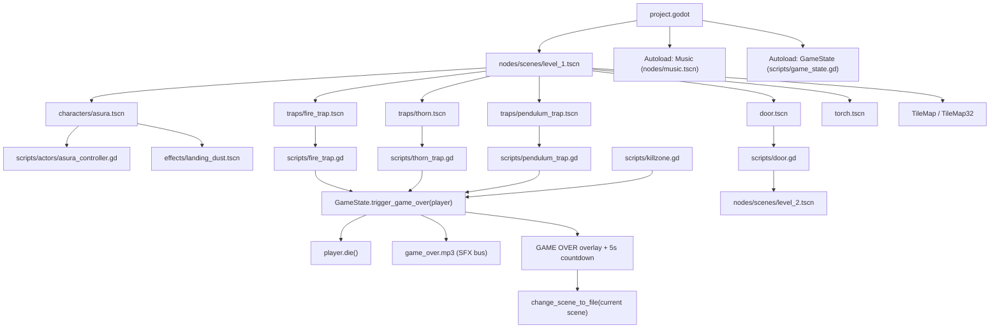

# Dungeon Traps - Project Architecture

Updated: 2026-09-17

This document describes the actual architecture and runtime behavior of the project.

## Core Principles

- Level scenes only hold placement, never logic.
- Trap/door/torch/player are self-contained reusable scenes that only know their own behavior.
- `GameState` is the single autoload that owns the death flow and restart.
- Every hazard goes through the same entry point: `GameState.trigger_game_over(body)`.
- Per-level configuration is passed via `@export`, never hard-coded in scripts.

## Runtime Diagram



## Layers Of Responsibility

### Project Config

`project.godot` defines the main scene, input map, autoloads, global groups and render defaults. It holds no gameplay logic.

- Main scene: `nodes/scenes/level_1.tscn` (referenced by UID `uid://l1dhtqji1d6x`).
- Autoload `Music`: scene `nodes/music.tscn`, an `AudioStreamPlayer` autoplaying `background_music.mp3` globally on the `Music` bus.
- Autoload `GameState`: `scripts/game_state.gd`.
- Global group: `player`.
- Input actions: `move_left` (A/←), `move_right` (D/→), `jump` (↑), `attack` (C), `slide` (X), `interact` (E), `switch_character` (Z, level 6).

`default_bus_layout.tres` defines the `Music` bus (-6 dB) and the `SFX` bus (0 dB), both routed to `Master`.

### Level Scenes

`nodes/scenes/level_1.tscn` (root `Level1`), `nodes/scenes/level_2.tscn` (root `Level2`) and `nodes/scenes/level_3.tscn` (root `Level3`).

A level contains:

- The player instance, with its camera and `PointLight2D` parented under it.
- TileMap/background.
- Trap, door and torch instances, grouped under plain `Node` list holders: `FireList`, `ThornList`, `BowTrapList`, `PendulumList`, `TorchList`, `SlimeList`, `BatList`, `StarList`, `ChestList`. Các holder này không phải `Node2D` nên không có transform, đưa instance vào list không làm đổi vị trí.
- Instance-specific configuration such as `Door.next_scene_path`.

Levels hold no death/restart logic, no character movement logic, and no global state. `level_4` có script kịch bản ở node gốc (`scripts/level_4_controller.gd`); `level_6` dùng `scripts/level_6_controller.gd` để chuyển nhân vật và camera.

### Reusable Gameplay Scenes

| Scene | Owning logic |
| --- | --- |
| `characters/asura.tscn` | `scripts/actors/asura_controller.gd` |
| `characters/serelyn.tscn` | `scripts/actors/serelyn_controller.gd` |
| `traps/fire_trap.tscn` | `scripts/fire_trap.gd` |
| `traps/thorn.tscn` | `scripts/thorn_trap.gd` |
| `traps/pendulum_trap.tscn` | `scripts/pendulum_trap.gd` |
| `door.tscn` | `scripts/door.gd` |
| `killzone.tscn` | `scripts/killzone.gd` |
| `torch.tscn` | Animation + `PointLight2D` in the scene, no script |
| `effects/landing_dust.tscn` | `scripts/landing_dust.gd` |
| `effects/skill_reveal.tscn` | `scripts/skill_reveal.gd` (rương tự instantiate) |
| `items/treasure_chest.tscn` | `scripts/treasure_chest.gd` (`@export skill_id` để trao kỹ năng) |
| `ui/skill_popup.tscn` | `scripts/ui/skill_popup.gd` (rương tự instantiate, level không đặt sẵn) |
| `enemies/slime.tscn` | `scripts/slime.gd` (only used by the legacy `game.tscn`) |
| `items/coin.tscn` | `scripts/coin.gd` (only used by the legacy `game.tscn`) |
| `platforms/pushable_wooden_crate.tscn`, `platforms/pushable_steel_crate.tscn` | `scripts/pushable_crate.gd` (`class_name PushableCrate`) |
| `platform.tscn`, `tile_map_32.tscn` | No script |

A reusable scene that needs to change global state calls an autoload or emits a signal; it never changes the scene itself.

### Scripts

Scripts live under `res://scripts/`, with `actors/` and `ui/` subgroups; the smaller gameplay scripts are currently flat in `scripts/`.

Files currently not referenced by any scene: `scripts/level_1_controller.gd` and `scripts/level_2_controller.gd` (both only `extends Node2D`), and `nodes/traps/gai.tscn` (the old thorn scene, still wired to `fire_trap.gd`, superseded by `traps/thorn.tscn`).

`scripts/level_4_controller.gd` là level controller duy nhất đang được dùng thật.

`scripts/save_game.gd` không gắn vào scene nào: nó là tiện ích static, chỉ
`GameState` gọi tới — xem mục Save File.

### Assets

`assets/` holds passive data only — textures, sounds, music, fonts. No gameplay scripts.

Sounds actually referenced by scenes: `running.mp3` and `sword_attack.mp3` (Asura), `fireball_whoosh.mp3` (fire trap), `coin.wav` (legacy coin), `game_over.mp3` (preloaded by `GameState`). The remaining files in `assets/sounds/` are unreferenced.

## Main Flows

### Player Movement

`asura.tscn` is a `CharacterBody2D` in the `player` group, on layer 2 with mask 1, driven by `scripts/actors/asura_controller.gd`.

The script handles gravity, jumping, left/right movement, ground/air sliding, sprite flipping, attacks (alternating `attack`/`attack2` on the ground, `jump_attack` — or `jump_attack2` once the spin skill is unlocked — while airborne), the idle/run/jump_up/jump_down/slide/death animations, landing dust when fall speed exceeds `LANDING_DUST_MIN_SPEED`, and `die()`. Air slide is limited to once per airborne period and resets when the player touches the floor.

Things to be aware of:

- During an attack, `velocity.x` is forced to 0.
- On death the script does not use `move_and_slide()`; it applies gravity and adds the result straight to `position`, producing the pop-up-then-fall effect.
- `die()` clears the collision layer/mask and disables the `CollisionShape2D`.
- `die()` is the contract `GameState` relies on — a player character must implement it.

### Game Over

`fire_trap.gd`, `thorn_trap.gd`, `bow_trap.gd`, `pendulum_trap.gd` and `killzone.gd` all share one death flow:

```text
Hazard body_entered
  -> if the body is in the player group
  -> /root/GameState.trigger_game_over(body)
  -> state = GAME_OVER, remember the current scene
  -> play game_over.mp3 (SFX bus)
  -> player.die()
  -> CanvasLayer overlay at layer 100 + 5 second countdown
  -> change_scene_to_file(current scene)
  -> reset_to_playing()
```

`GameState` runs with `PROCESS_MODE_ALWAYS` and restarts the **scene currently being played** (`_get_current_scene_path()`) rather than always level 1; `DEFAULT_RESTART_SCENE_PATH` is only a fallback. Hazards never reload the scene themselves.

### Fire Trap

The fire trap has two areas: `TriggerArea` (mask 2) and the damage area on the root `Area2D` itself (mask 2).

```text
_ready
  -> nếu always_active: tắt TriggerArea, bật luôn sprite + damage shape (không phát AppearSound)
  -> ngược lại: sprite hidden, damage shape disabled
TriggerArea.body_entered (player)
  -> disable the trigger's monitoring
  -> show the sprite, play AppearSound
  -> enable the damage shape and monitoring
body_entered (player) -> GameState.trigger_game_over()
```

`extinguish()` dập tắt bẫy vĩnh viễn: tắt `TriggerArea`, damage shape và monitoring, rồi làm mờ sprite cùng `PointLight2D` trong `EXTINGUISH_DURATION` (0.3s) và ẩn đi. `_activate()` bỏ qua bẫy đã tắt. Hiện chỉ hộp sắt gọi hàm này — xem mục Pushable Crate.

Exported parameter: `always_active` (mặc định `false`). Bật lên thì bẫy cháy sẵn từ đầu màn — dùng cho dàn lửa đặt làm chướng ngại nhìn thấy trước chứ không phải bẫy bất ngờ. Trường hợp này `AppearSound` bị bỏ qua, vì cả dàn sẽ kêu cùng lúc lúc vào màn. `level_4` đặt `always_active = true` cho `FireList/Fire2..Fire31` (dải lửa ở `y = -936`); riêng `FireList/Fire` vẫn là bẫy nấp chờ.

### Pushable Crate

Hai scene hộp 32x32 dùng chung `scripts/pushable_crate.gd`, gốc là `CharacterBody2D` đặt tâm ở giữa hộp (đặt vào lưới 32px thì toạ độ là tâm ô):

| Scene | `push_speed` | `breakable` | `FireSensor` |
| --- | --- | --- | --- |
| `platforms/pushable_wooden_crate.tscn` | 120 | `true` | Không |
| `platforms/pushable_steel_crate.tscn` | 100 | `false` | Có |

Hộp nằm trên layer 1 (world), mask 1, nên nhân vật đứng lên nóc như mặt đất và slime/đạn coi nó là tường. Hộp có trọng lực, đẩy ra khỏi mép thì rơi.

```text
asura_controller.gd, nhánh di chuyển thường, sau move_and_slide()
  -> nếu is_on_floor() và có bấm hướng: PushableCrate.push_touching(self, direction)
push_touching: duyệt slide collision, collider là PushableCrate
  -> bỏ qua nếu normal.x * direction > -PUSH_NORMAL_MIN (0.7): không phải mặt bên phía trước
  -> crate.push(direction)   # hộp đang rơi thì bỏ qua
PushableCrate._physics_process
  -> velocity.x = hướng bị đẩy ở bước vừa rồi * push_speed, rồi reset về 0
  -> move_and_slide(); nếu đang bị đẩy thì push_touching(self, ...) để hộp đẩy hộp
```

Hộp chỉ trượt trong bước physics được đẩy, nên buông phím là dừng ngay. Nhảy vào hộp giữa không trung, lướt (slide) hay đang chém đều không đẩy. Đứng trên nóc hộp không đẩy được chính nó nhờ ngưỡng `PUSH_NORMAL_MIN`.

**Hộp gỗ vỡ khi bị chém.** `breakable = true` làm `_ready()` bật thêm layer 3 (lớp mà `AttackHitbox` mask) và thêm hộp vào group `breakable`. `hit_enemy()` của nhân vật gọi `break_apart()` cho group này thay vì `die()`: tắt va chạm ngay (người đứng trên nóc rơi xuống luôn), phát tiếng poof trên một `AudioStreamPlayer2D` gắn vào `current_scene`, cắt ảnh hộp thành bốn góc văng theo cung parabol rồi `queue_free()`. Hộp sắt không có layer 3 nên đòn chém đi xuyên qua.

**Hộp sắt dập lửa.** `FireSensor` (Area2D, layer 0, mask 1, shape 20x30) nối `area_entered`; area nào có `extinguish()` thì gọi. Sensor hẹp hơn thân hộp để lửa chỉ tắt khi hộp đã phủ lên ngọn lửa. Bẫy lửa nấp chờ chưa bật damage shape thì sensor chưa thấy, nên hộp đặt sẵn trên bẫy nấp chờ sẽ dập lửa ngay khi bẫy bùng lên. Hộp gỗ không có sensor, đi qua lửa không có tác dụng gì.

Hạn chế đã biết: hộp chồng lên hộp không trượt theo khi hộp dưới bị đẩy (`CharacterBody2D` không báo vận tốc nền cho vật đứng trên), hộp trên sẽ rớt khỏi mép.

### Thorn Trap

`traps/thorn.tscn` is a `Node2D` containing `Hazard` (an Area2D) and `TriggerArea`.

```text
_ready: physics process disabled
TriggerArea.body_entered (player) -> _is_falling = true, enable physics process
_physics_process: raycast downward from 3 points (-half_width, 0, +half_width)
  -> on hitting the floor, snap to the floor surface and stop
  -> or stop after falling past max_fall_distance
Hazard.body_entered (player) -> GameState.trigger_game_over()
```

Exported parameters: `fall_speed`, `max_fall_distance`, `floor_collision_mask`, `thorn_half_width`, `thorn_half_height`, `floor_probe_margin`. The script halts itself when `GameState.is_game_over()`.

### Pendulum Trap

`traps/pendulum_trap.tscn` là quả cầu gai treo bằng xích, đu qua lại liên tục. Gốc node chính là **điểm neo**, nên đặt instance ngay tại mặt trần là con lắc treo đúng chỗ — không phải căn lại sprite con.

```text
_ready -> nối Pivot/Ball.body_entered
_physics_process
  -> nếu GameState.is_game_over() thì dừng, để khung hình chết không còn quả cầu đu
  -> Pivot.rotation = swing_angle * sin(TAU * (t / swing_period + phase_offset))
Ball.body_entered (player) -> GameState.trigger_game_over()
```

Cả cây con lắc là **một `Sprite2D` duy nhất** vẽ trọn `doom-ball.png` (vòng neo, xích và quả cầu), không cắt ảnh ra thành nhiều mảnh. Sprite đặt ở `(0, 80)` để mép trên của ảnh trùng điểm neo, `Ball` đặt ở `(0, 127)` là đúng tâm quả cầu trong ảnh; cả hai đều là con của `Pivot` nên chỉ cần xoay một node là toàn bộ con lắc đu theo. `Ball` là `Area2D` di chuyển trong `_physics_process` nên va chạm vẫn được tính đúng từng frame vật lý.

Exported parameters:

| Tham số | Mặc định | Ý nghĩa |
| --- | --- | --- |
| `swing_angle_degrees` | 55 | Góc lệch tối đa so với phương thẳng đứng, cho mỗi bên |
| `swing_period` | 4.4 | Thời gian một chu kỳ đầy đủ (giữa → phải → giữa → trái → giữa) |
| `phase_offset` | 0.0 | Dịch pha theo tỉ lệ chu kỳ (0..1), để các con lắc cạnh nhau đu so le |

Độ dài con lắc là cố định theo ảnh (157px từ điểm neo tới đáy quả cầu), nên **tầm với chỉnh bằng `scale` của node gốc** chứ không có tham số riêng. Scene để sẵn `scale = 1.5`, chọn theo hành lang cao 256px của `level_4` (trần và sàn cách nhau 8 ô 32px): lúc buông thẳng, đáy quả cầu chỉ cách sàn 20px nên chặn cả người đứng lẫn người lướt; lúc đu tới góc lớn nhất thì cầu nhấc lên đủ cho player chạy qua bên dưới. Đặt ở hành lang cao khác thì lấy `scale = (chiều cao hành lang - 20) / 157`.

Hitbox là `CircleShape2D` bán kính 26 trong khi gai vươn tới 30px, tức là hơi rộng lượng với người chơi. Bán kính này nằm trong node đã bị `scale`, nên phóng to sprite thì hitbox phóng theo.

### Door / Level Transition

`door.gd` uses two Area2Ds:

- `OpenArea`: entering it plays the `open` animation.
- `PassArea`: entering it once the door is open changes the scene after a 0.3s delay.

`next_scene_path` is an `@export`, configured per level instance.

- `level_1` points to `res://nodes/scenes/level_2.tscn`.
- `level_2` points to `res://nodes/scenes/level_3.tscn`.
- `level_3` points to `res://nodes/scenes/level_4.tscn`. Rương của màn này trao kỹ năng `spin_jump_attack`.
- `level_4` points back to `res://nodes/scenes/level_3.tscn` (chưa có màn 5).
- An empty `next_scene_path` means the door does not change scenes.

Qua được `PassArea` lúc cửa đã mở cũng là lúc màn được tính là hoàn thành:
`_go_to_next_scene()` gọi `GameState.complete_level()` **trước** khi đổi scene, vì
`GameState` nhận diện màn qua `_get_current_scene_path()` và đường dẫn đó chỉ còn
đúng ở thời điểm này. Cửa cuối chưa trỏ đi đâu vẫn tính là hoàn thành rồi mới dừng.

### Skills

Kỹ năng mở khoá được khai báo một chỗ duy nhất trong `scripts/skills.gd` (`class_name Skills`): tên hiển thị, mô tả, phím tắt và ô icon trong dải `assets/sprites/skills/skills.png` (mỗi ô 32x32, `icon_index` tính từ 0).

`GameState` giữ kỹ năng ở **hai** danh sách tách bạch:

| Danh sách | Nội dung | Mất khi tắt game? |
| --- | --- | --- |
| `_unlocked_skills` | `skill_id -> scene_path`, kỹ năng vừa nhặt nhưng chưa đi hết màn | Có |
| `_saved_skills` | `skill_id -> true`, kỹ năng đã hoàn thành màn và ghi ra file | Không |

`has_skill()` trả về true nếu kỹ năng nằm ở một trong hai, nên nhặt xong là dùng
được ngay trong màn đó chứ không phải đợi qua cửa. `clear_level_progress(scene_path)`
chỉ khoá lại được kỹ năng còn nằm ở `_unlocked_skills`, tức là kỹ năng nhặt trong
màn đó mà chưa đi hết màn — chơi lại một màn cũ không làm mất kỹ năng đã kiếm được.

```text
TreasureChest.body_entered (player)
  -> GameState.mark_chest_opened(), phát animation "open"
  -> nếu skill_id rỗng thì dừng ở đây
  -> GameState.unlock_skill(skill_id)   # ghi nhận trước phần trình diễn
  -> await animation_finished (không đóng băng animation mở rương)
  -> effects/skill_reveal.tscn: icon bay lên khỏi nắp rương, nở to, sáng dần
  -> nếu GameState.is_game_over() thì bỏ popup
  -> instantiate ui/skill_popup.tscn vào current_scene, show_skill(skill_id)
  -> popup pause SceneTree, bảng fade + scale vào, đóng bằng Continue/Space/ESC
```

Kỹ năng được `unlock_skill()` ngay lúc rương mở chứ không phải cuối phần trình diễn: rương đã bị đánh dấu là đã mở nên nếu người chơi chết giữa chừng, đợi tới cuối mới ghi nhận là mất luôn kỹ năng. Vì lý do ngược lại, `_show_skill_popup()` bỏ qua popup khi đang game over — popup pause SceneTree, mà sau khi màn được load lại thì không còn node nào gỡ pause ra nữa.

`skill_reveal.tscn` là ngoại lệ của quy ước modulate ở mục Lighting: icon phần thưởng để nguyên độ sáng và tự mang theo `PointLight2D`.

| Skill | Rương trao | Hiệu ứng |
| --- | --- | --- |
| `spin_jump_attack` | `level_3` | Đòn chém trên không đổi sang cú lộn vòng: animation `jump_attack2` và vùng sát thương rộng hơn. |
| `wall_double_jump` | `level_4` | Đang trên không và chạm tường thì nhấn `jump` (mũi tên lên) được nhảy thêm một lần. |

`get_jump_attack_anim()` là chỗ duy nhất quyết định đòn trên không dùng animation
nào; `get_attack_shape()` đã tự map `jump_attack2` sang `SpinShape` nên chỉ cần
đổi tên animation là cả hình lẫn tầm đánh đổi theo. Không có kỹ năng thì đòn cũ
`jump_attack` (3 khung, `JumpShape` 52x78) giữ nguyên; có kỹ năng thì
`jump_attack2` (4 khung 110x110, nhân vật lộn trọn một vòng) dùng `SpinShape`
84x96 đặt ở `(14, -3)` — vươn ra sau lưng chứ không chỉ về phía trước, đúng với
đường kiếm quét vòng tròn trong ảnh.

Cú lộn vòng chỉ dùng được **một lần mỗi lần rời mặt đất**: `spin_attack_used`
được đặt lúc bấm và chỉ hồi lại khi `is_on_floor()`, cùng chỗ hồi `air_slide_used`
và `wall_jump_used`. Bấm tiếp giữa không trung thì không ra đòn nào cả — kể cả
`jump_attack` cũ, vì có kỹ năng rồi thì `get_jump_attack_anim()` không còn trả về
animation đó nữa. Nhảy tường không hồi lại lượt lộn vòng, phải chạm đất mới có.
Chưa mở rương thì `jump_attack` cũ vẫn bấm liên tiếp thoải mái như trước.

`jump_attack2` chạy ở `speed = 16.0` (0.25s trọn vòng lộn), nhanh hơn hẳn
`jump_attack` cũ ở 10.0. Không phải chỉ để nhìn cho đã: `velocity.x` bị ép về 0
suốt đòn đánh, nên animation dài bao nhiêu là nhân vật treo lơ lửng bấy nhiêu —
cú lộn phải kết thúc gọn thì mới không cảm giác khựng giữa không trung.

`asura_controller.gd` chỉ cho phép nhảy tường khi `GameState.has_skill(Skills.WALL_DOUBLE_JUMP)`. Mỗi lần bám vào một mặt tường mới (hoặc chạm đất) sẽ hồi lại một cú nhảy tường, nên có thể leo nối tiếp qua nhiều tường nhưng không thể bay vô hạn trên cùng một mặt tường.

`WALL_JUMP_VELOCITY = JUMP_VELOCITY`: cú nhảy tường gán đè `velocity.y` chứ không cộng dồn, nên bật cao đúng bằng cú nhảy từ mặt đất. Lúc đạp tường, `spawn_wall_dust()` thả một `effects/landing_dust.tscn` ngay trên mặt tường (lệch `WALL_DUST_REACH` sang phía tường, `flip_h` để luồng bụi thổi ra xa tường).

Bảng nhân vật trong `pause_menu.tscn` có sẵn hàng `SkillList/SpinJumpAttack` và `SkillList/WallJump` nhưng đều để `visible = false`; `_pause()` bật từng hàng lên theo `GameState.has_skill()`.

### Serelyn / Party

`level_6.tscn` đặt `characters/serelyn.tscn` trên sàn gần điểm xuất phát. Khi
Asura vào vùng tương tác, nhấn E để mở ba câu hội thoại; game tạm dừng trong lúc
đọc. Sau khi đóng hội thoại, `GameState.recruit_party_member("serelyn")` ghi
thành viên vào `user://save_game.json`. Nếu Serelyn đã gia nhập từ lần chơi
trước, có thể chuyển nhân vật ngay khi vào level 6.

`scripts/level_6_controller.gd` xử lý phím Z để chuyển điều khiển, camera và
`PointLight2D` đang gắn với Asura sang Serelyn hoặc chuyển về Asura. Chỉ
`CharacterBody2D` đang điều khiển thuộc nhóm `player`, nên bẫy,
cửa và vật phẩm dùng đúng nhân vật hiện tại. Nhân vật còn lại vẫn đứng trên sàn.
Serelyn là `CharacterBody2D` với `AnimatedSprite2D` chứa idle 5 khung, run 6 khung,
`jump_up` và `jump_down`; khi được điều khiển, nhân vật nhận di chuyển trái/phải
và nhảy bằng phím `jump`. Phím `slide` lướt theo hướng đang nhìn trong 0,4 giây
trên mặt đất; trong lúc lướt, capsule va
chạm được hạ thấp, animation `slide` và hiệu ứng bụi được phát. Khi rơi đủ nhanh
để tiếp đất, Serelyn cũng tạo bụi như Asura. Serelyn chưa có tấn công. Phím Z bị khóa khi đang hội thoại, tạm dừng
hoặc game over.

### Save File

`scripts/save_game.gd` (`class_name SaveGame`) là toàn bộ phần đọc/ghi đĩa của
game: một file JSON ở `user://save_game.json`, chứa kỹ năng đã kiếm được và
thành viên đã gia nhập đội.

```json
{
	"version": 1,
	"unlocked_skills": ["spin_jump_attack"],
	"party_members": ["serelyn"]
}
```

`version` chưa được dùng để làm gì, nhưng có sẵn để bản game sau còn đọc được
file của bản trước khi cấu trúc đổi. File ghi kèm tab xuống dòng nên mở ra sửa
tay lúc test rất nhanh.

`SaveGame` có các hàm static đọc/ghi kỹ năng và thành viên; khi ghi một danh sách,
nó giữ nguyên danh sách còn lại. `GameState` là node duy nhất gọi tới nó — phần
còn lại của game hỏi `GameState.has_skill()` hoặc `has_party_member()`.

`user://` nằm ngoài thư mục project (trên Linux là
`~/.local/share/godot/app_userdata/<tên project>/`), nên file save không bao giờ
lọt vào repo; `.gitignore` vẫn chặn tên `save_game.json` để phòng trường hợp có
người copy nó vào project để xem. Bản export HTML thì Godot ánh xạ `user://` vào
IndexedDB của trình duyệt, cùng đoạn code chạy được cả hai nơi.

```text
TreasureChest mở  -> GameState.unlock_skill()   # vào _unlocked_skills (tạm)
Door PassArea     -> GameState.complete_level() # chuyển sang _saved_skills + ghi file
Mở game lần sau   -> GameState._ready()         # SaveGame.load_skills() nạp lại
```

Kỹ năng chỉ được ghi ra file khi người chơi **vừa mở rương vừa đi hết màn đó**.
Nhặt xong rồi chết hoặc thoát giữa chừng thì phần thưởng không được tính, nhưng
vẫn dùng được cho tới hết phiên chơi vì `_unlocked_skills` còn giữ.

`complete_level()` chỉ ghi đĩa khi thật sự có kỹ năng mới, nên đi qua cửa ở màn
không có rương không tốn một lần ghi file nào.

Chống hỏng dữ liệu: mọi lỗi đọc/ghi chỉ `push_warning`/`push_error` rồi đi tiếp,
chưa có file được coi là bình thường (lần chơi đầu), và `load_skills()` bỏ qua id
không còn trong `Skills.CATALOG` — xoá một kỹ năng khỏi catalog không làm file
save cũ dựng game lên.

`clear_level_progress()` gọi với `scene_path` rỗng là lệnh xoá sạch, kể cả file
save; gọi với một màn cụ thể (nút Restart và màn hình chọn màn đang dùng) thì
không đụng tới file.

### Level 4 Bat Ambush

`TreasureChest` phát signal `opened` đúng lúc người chơi mở rương và không quan tâm ai nghe. `scripts/level_4_controller.gd` (gắn ở node gốc `Level4`) nối vào signal đó:

```text
_ready
  -> gom BatList/Bat2..Bat6 vào _ambush_bats
  -> nếu chest.is_open (đã mở từ lần chơi trước) thì để nguyên đàn dơi, dừng
  -> ngược lại: bat.set_dormant(true) cho cả đàn, rồi nối chest.opened
chest.opened
  -> lần lượt bat.appear(index * AMBUSH_STAGGER)
```

`Bat` (con đầu tiên) bay sẵn từ đầu màn, không nằm trong danh sách phục kích.

`bat.gd` tự lo phần trạng thái của mình, controller không thò tay vào node con của bat:

- `set_dormant(true)`: ẩn sprite, tắt `_physics_process`, tắt `CollisionShape2D`, `Killzone` và `DetectionArea`. Bat đang ngủ đông không bay, không đuổi player, không giết được player và cũng không bị chém trúng.
- `appear(delay)`: chờ `delay` rồi bật lại và hiện dần ra (fade + scale).

`chest.is_open` là điểm neo cho việc hồi sinh: `GameState` đã nhớ rương được mở, nên sau khi chết và load lại màn thì đàn dơi vẫn ở ngoài chứ không bị giấu lại.

### Lighting

The project does not use `CanvasModulate`. Darkness is faked by lowering each object's `modulate`, then `PointLight2D` adds brightness back on top.

| Node | modulate |
| --- | --- |
| `TileMap` in `level_1` | 0.733 |
| `TileMap16` in `level_3` | 0.733 |
| `Asura` instance in a level | 0.545 |
| `torch.tscn` root | 0.439 |
| `fire_trap.tscn/AnimatedSprite2D` | 0.431 |
| `thorn.tscn/Hazard/Sprite2D` | 0.431 |
| `pendulum_trap.tscn` root | 0.6 |
| `platforms/pushable_*_crate.tscn` root | 0.6 |

Light sources: a `PointLight2D` under `Asura` in each level, one under the fire trap's `AnimatedSprite2D`, and one under the torch root.

New gameplay sprites must lower their `modulate` in line with the table above; otherwise they stay at full brightness and appear unaffected by the lights.

### Music

`Music` is the autoload scene `nodes/music.tscn`, whose root `AudioStreamPlayer` autoplays `background_music.mp3` globally on the `Music` bus. It is non-positional, so camera and player movement do not change its volume. Every other sound effect goes through the `SFX` bus.

## Collision And Groups

| Scene | Layer | Mask |
| --- | --- | --- |
| `asura.tscn` | 2 | 1 |
| `fire_trap.tscn` root | 0 | 2 |
| `fire_trap.tscn` `TriggerArea` | 0 | 2 |
| `thorn.tscn` `Hazard` | 0 | 2 |
| `thorn.tscn` `TriggerArea` | 0 | 2 |
| `pendulum_trap.tscn` `Pivot/Ball` | 0 | 2 |
| `door.tscn` `OpenArea` / `PassArea` | 0 | 3 |
| `killzone.tscn` | 0 | 2 |
| `items/coin.tscn` | 0 | 2 |
| `platforms/pushable_steel_crate.tscn` | 1 | 1 |
| `platforms/pushable_steel_crate.tscn` `FireSensor` | 0 | 1 |
| `platforms/pushable_wooden_crate.tscn` | 1 + 3 (bật lúc chạy) | 1 |

Layer meanings:

| Layer | Meaning |
| --- | --- |
| 1 | World / TileMap / Platform / Pushable crate |
| 2 | Player |
| 3 | Enemies và vật chém vỡ được (`AttackHitbox` chỉ mask lớp này) |

Conventions:

- Player scenes sit on layer 2 and belong to the `player` group.
- Hazards confirm the player via `body.is_in_group("player")` and mask only layer 2.
- Items mask only layer 2.
- Enemies and hazards never depend on the player being on layer 1.

`door.tscn` currently uses mask 3 (catching both layer 1 and 2), the only remaining deviation from this convention.

## Responsibility Boundaries

- A level only places objects and configures instances.
- The player only manages its own input, movement, animation and death state.
- A trap only detects collisions and reports to the game state.
- A door only handles opening and scene transitions.
- `GameState` only manages global state, the game over overlay and restarting.
- The assets folder only holds visual/audio/font data.
